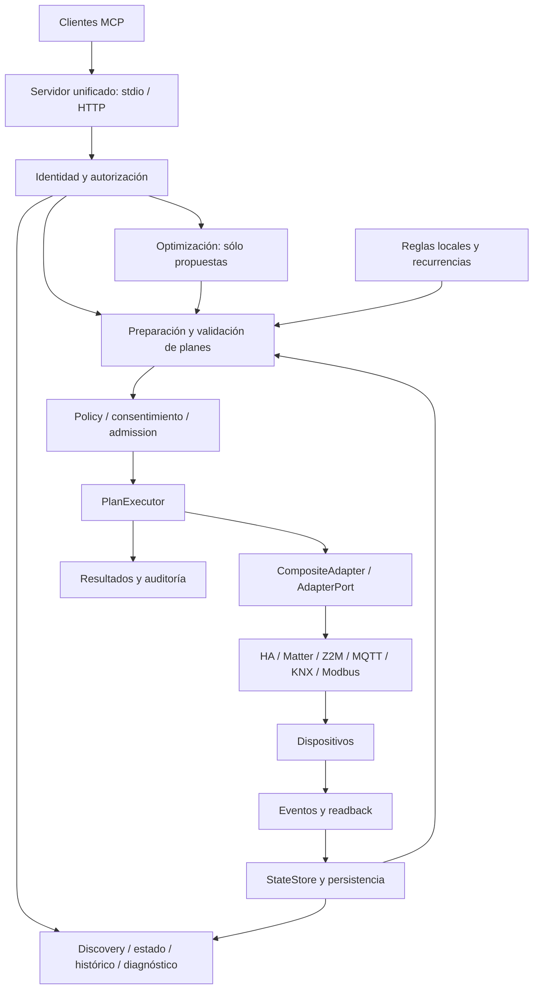

# Auditoría integral de DomoAI: universalidad, MCP y composición

Fecha: 2026-09-06. Referencia Git: `d6c19e0b80631ce6095b7f6bc45a0036003cee78`, **más el estado modificado del árbol de trabajo**. El SHA por sí solo no reproduce esta evaluación.

Desarrollo detallado por fases: [índice de las fases 00–08](auditoria-universalidad-2026-09-06/README.md). La serie amplía los criterios de cierre; no implica que los defectos estén corregidos.

## 1. Dictamen

DomoAI implementa una infraestructura domótica semántica considerable: un MCP público, conectores internos, estado persistente, validación, políticas, consentimiento, ejecución, programación y optimización separada de la autoridad física. La definición aportada por el usuario describe correctamente su dirección arquitectónica.

**No cumple todavía la afirmación literal de «cualquier IA, cualquier vivienda, toda su domótica, funcionando conjuntamente».** Hay cobertura semántica limitada, condiciones de instalación e interoperabilidad, qualification física pendiente y defectos reproducidos en la composición de automatizaciones. No es correcto describir el trabajo restante únicamente como kits de instalación y validación externa.

| Pregunta | Dictamen | Motivo |
|---|---|---|
| ¿Es un MCP general de domótica? | Sí, implementado | Un servidor público registra domótica y optimización sobre contexto compartido. |
| ¿Tiene funcionalidad real de software? | Sí | Servicios y conectores ejecutables, persistencia, solver y pruebas cruzadas; no es sólo documentación. |
| ¿Es independiente de un modelo de IA concreto? | Sí en arquitectura | El backend no requiere Claude, Codex o Gemini para evaluar reglas y ejecutar planes. |
| ¿Es universal por abstracción? | Sí, con límites | `AdapterPort` y el modelo semántico permiten incorporar conectores internos. |
| ¿Opera toda la domótica existente? | No | Los mappers reconocen subconjuntos concretos; muchas funciones habituales no tienen traducción. |
| ¿Se adapta automáticamente a cualquier casa? | Parcial | Descubre y reconcilia lo soportado; mappings, perfiles, credenciales y commissioning requieren preparación. |
| ¿Funciona todo el conjunto? | No sin reservas | La activación repetida de reglas locales y la conservación de autoridad presentan defectos. |
| ¿Está cualificado para cualquier instalación física? | No demostrado | Simulación y dependencias de laboratorio no prueban equipos, firmware, cableado o radios reales. |
| ¿Es «el más completo»? | No evaluable con esta evidencia | Exigiría un conjunto de competidores y criterios comparables; no se realizó ese benchmark. |

Conclusión de composición: **FAIL para la aceptación universal solicitada**. Arquitectura aprovechable y funcionalidad extensa, pero con correcciones de software necesarias antes de cerrar esa aceptación.

## 2. Alcance y método

Se revisaron las fronteras de los componentes de `src/domoai`, configuración y despliegue, catálogo de Skills, contratos MCP, esquemas, pruebas y especificaciones relevantes. Inventario observado: 203 archivos bajo `src/domoai`, 354 bajo `tests` y 195 documentos `spec.md`. Son recuentos de archivos, no porcentajes de cobertura.

La revisión es transversal y basada en riesgo: **no equivale a una inspección manual de cada línea ni a una certificación de seguridad**. Se verificaron directamente las rutas críticas y se ejecutaron comprobaciones existentes y reproducciones adicionales. Los hallazgos distinguen hechos reproducidos, limitaciones por inspección y verificaciones no realizadas.

Se aplicaron Graphify, `system-composition-review`, `systematic-debugging` para los defectos encontrados y `verification-before-completion`. Graphify contenía 8.279 nodos; orientó la navegación hacia registry, state store, policy, admission y executor. La consulta amplia devolvió 829 nodos con salida acotada: no se tomó como prueba exhaustiva ni sustituyó la lectura de código. El vocabulario verificado incluyó `runtime`, `executor`, `adapter`, `policy`, `automation`, `privacy`.

Se consultaron `AI_WORKFLOW.md`, `.ai/composition/README.md`, la baseline Spec Kit 196 y los artefactos del programa universal. No se creó una nueva especificación de implementación: el encargo es evaluar y documentar, sin cambiar comportamiento. No se corrigieron los defectos hallados.

Había numerosos cambios, archivos nuevos y auditorías anteriores antes de comenzar. Se creó este documento para conservarlos. No se leyó el contenido de credenciales ni se usaron bases de datos operativas para las reproducciones. Las suites se lanzaron retirando las variables `DOMOAI_*` del proceso hijo; no se activaron pruebas físicas mediante credenciales del hogar.

## 3. Qué debe significar «universal»

Conviene mantener separadas seis propiedades:

1. **Universalidad de cliente:** negociación MCP, transportes y autenticación que el host concreto pueda utilizar.
2. **Universalidad semántica:** capacidades normalizadas con unidades, límites, identidad, estados y errores interpretables.
3. **Cobertura efectiva:** funciones concretas traducidas y probadas para cada ruta instalada.
4. **Adaptación a la vivienda:** descubrimiento, asociación a áreas, reconciliación de identidades, commissioning y detección de cambios.
5. **Seguridad operacional:** autorización, consentimiento, frescura, idempotencia, ejecución y readback coherentes de extremo a extremo.
6. **Evidencia física:** hardware, firmware, perfil y topología identificados, con resultados vigentes.

DomoAI está mejor desarrollado en abstracción y controles de ejecución que en cobertura general de dispositivos, instalación automática y demostración física. Añadir tools por fabricante no resolvería esas diferencias y rompería el objetivo público correcto.

## 4. Arquitectura real y propiedad del estado



`UnifiedMcpContext.__post_init__` exige compartir registro y servicio de planes (`src/domoai/mcp/unified_server.py:35`). `create_unified_server` registra ambas familias sobre FastMCP. Los módulos llamados `domotics_server.py` y `ortools_server.py` no prueban por sí solos que existan dos servidores públicos: el builder unificado los usa como módulos de registro.

`runtime_factory.py` compone repositorios, aprobaciones, registry, state store, conectores, refresco, consumidor de eventos, scheduler y reglas locales. En sus líneas 1515–1542 conecta el motor local tanto a eventos de estado como a la evaluación temporal del scheduler.

El dispositivo físico no participa en la transacción SQLite. Por ello «todo validado antes de empezar» no significa «todos los efectos físicos son atómicos». El sistema necesita resultados parciales/desconocidos y reconciliación; la presencia de estos estados es correcta.

## 5. Evaluación por componente

| Componente | Implementación y evidencia inspeccionada | Evaluación y límite |
|---|---|---|
| Dominio y contratos | `domain/models.py`, `domain/automation.py`, `schemas/v1`, pruebas de dominio/contrato | Tipado, unidades, límites, garantías y estados explícitos. `extra=forbid` no implica que toda validación Pydantic sea estricta frente a coerciones. Ontología de tipos limitada. |
| Discovery | `application/discovery_service.py`, mappers de conectores | Existe normalización y publicación de inventario. Detectar una entidad no garantiza poder controlarla. |
| Identidad y rutas | `runtime/registry.py:36`, `:260`, `:476` | Rehidrata identidades y reconstruye rutas con evidencia viva. Reserva IDs persistidos y evita adjudicaciones ambiguas. No constituye un resolvedor infalible de equivalencias entre fabricantes. |
| Estado e histórico | `runtime/state_store.py:62`, repositorios de estado e histórico | Caché con metadatos durables, versiones, cursores, orden y frescura. Histórico con retención. Revisar la composición con privacidad, no sólo su escritura. |
| Eventos y refresco | `runtime/composite_adapter.py`, `application/event_consumer.py`, `state_refresher.py` | Colas, coalescencia, pérdidas observables y reconexión. El estado debe poder resincronizarse; no se demuestra entrega exactamente una vez de cualquier evento físico. |
| Planes y validación | `application/plan_service.py:78`, `:107`, `facade.py` | Normaliza comandos y aplica semántica y policy. Crear un plan nuevo no copia por sí mismo la autoridad de una plantilla: defecto en consumidores automáticos. |
| Riesgo y policy | `runtime/risk_classifier.py:25`, `application/policy_engine.py:22` | Clasificación por comando y dispositivo; overrides ordinarios no rebajan riesgo. `RESTRICTED` exige confirmación, no equivale a `DENY`. Un relé clasificado como switch necesita conocer qué carga física gobierna. |
| Consentimiento | `runtime/approval_store.py`, `application/execution_admission.py:332` | Grants, digest, expiración, reservas y consumo; autenticación del agente separada del gesto humano. Preservación de autoridad al automatizar aún defectuosa. |
| Admission y fencing | `application/execution_admission.py:141`, `executor.py:440` | Gate de agregado y predecesores; fencing antes de escribir cuando está configurado. La eficacia física depende de toda la ruta, no sólo del token. |
| Executor y readback | `application/executor.py:174`, `:490`, `:1127` | Claim durable, revalidación, precondiciones, control dinámico, resultados y readback. No confunde necesariamente ACK con éxito confirmado. El consumidor de automatizaciones sí pierde esa distinción. |
| Bundles | `application/bundle_commit.py`, pruebas de autoridad y dependencias | Agregado con validación, digest, orden y ejecución por executor común. Posible compromiso parcial físico; no anunciar rollback universal. |
| Escenas | `application/scene.py:15`, registro de `execute_scene` | Envelope con digest y hasta 50 miembros; usa bundles. No es un catálogo general de escenas nativas importadas automáticamente desde cualquier proveedor. |
| Scheduler y recurrencia | `application/scheduler.py`, `recurrence.py` | Persistencia, vencimiento y recuperación. La creación de ocurrencias en `scheduler.py:780` merece corrección de autoridad; el resumen en `:822` ignora resultados devueltos por el executor. |
| Automatización local | `application/local_automation.py:183`, `:239` | Triggers de estado/tiempo, condiciones, consentimiento y cooldown. Tres defectos reproducidos: autoridad, identidad entre activaciones y resumen de fallo. |
| Optimización | `optimizer/cp_sat.py:34`, `application/optimization_service.py` | OR-Tools genera propuestas. Validación separada; objetivos y restricciones explícitos. No demuestra optimalidad o ahorro reales fuera de los supuestos del escenario. |
| Aislamiento del solver | `application/process_optimization_worker.py:43` | Pool de procesos con presupuesto y cancelación por timeout; apropiado para no dejar un solver bloqueando el runtime. No extrapolar las pruebas locales a capacidad de cientos de hogares. |
| Contexto energético | `optimizer/providers.py:473`, `domain/energy.py`, OMIE y Open-Meteo | Alineación temporal, revisiones, unidades y frescura. OMIE no representa automáticamente cualquier contrato tarifario mundial. Sin Internet puede agotarse la validez del contexto y bloquearse una propuesta. |
| Seguridad energética | `dynamic_safety.py`, `battery_composition.py`, perfiles y qualification | Gates específicos para batería/EV/thermal. Requieren bindings y parámetros válidos; no se deducen con seguridad a partir de un nombre visible. |
| Gateway MCP | `mcp/unified_server.py:47`, `gateway.py:44`, `stdio.py:62` | Endpoint único y ciclo de vida compartido. Catálogo depende del contexto/configuración. GET sin SSE es válido, pero el rechazo temprano evita validar Origin en esa rama. |
| Identidad multi-hogar | `application/authority.py:51`, `mcp/auth.py:87` | Contexto y scopes explícitos. `AuthorityPolicy` corresponde a un hogar de despliegue; un token con varios hogares no transforma ese proceso en un router universal multi-hogar. |
| Tokens | `mcp/auth.py`, `token_lifecycle.py` | Hashes, comparación constante, expiración, rotación y revocación. Es un perfil de bearer aprovisionado; no acredita el flujo OAuth completo de cualquier host. |
| Persistencia | `persistence/sqlite.py`, `serialized.py`, `repositories.py`, migraciones | SQLite, workers serializados, transacciones y recuperación. APIs de control plane PostgreSQL/etcd son otro perfil operativo, no una garantía de alta disponibilidad ya validada en toda instalación. |
| Auditoría | `runtime/events.py`, `persistence/audit_outbox.py`, repositorio separado | Registro y outbox refuerzan durabilidad. Protección frente al cliente MCP no equivale a inmutabilidad criptográfica frente al administrador del disco. |
| Backup/restore | `persistence/backup.py:490`, pruebas de lifecycle | Integridad, staging, ownership, rollback y cifrado disponibles. Su operación real, custodia de clave y recuperación sobre el entorno destino deben cualificarse. |
| Privacidad | `application/privacy.py:35`, `persistence/privacy.py:30`, `domain/privacy.py:48` | Exporta/borra categorías autorizadas y redacta claves sensibles. Exportaciones grandes fallan; borrado por categoría no equivale a borrar cachés, backups ni toda huella del hogar. |
| Métricas y salud | `application/metrics.py`, `runtime/operational_metrics.py`, `mcp/health.py`, `remote_metrics.py` | Salud, frescura, colas y fallos observables. `/metrics` verifica bearer; no aplica en esa ruta todos los filtros finos por área/dispositivo del catálogo MCP. |
| SDK de conectores | `runtime/ports.py`, `adapters/sdk/conformance.py:136` | Contrato de lifecycle, discovery, estado, ejecución y eventos. La prueba segura comprueba idempotencia/readback con una muestra, no todos los comportamientos del protocolo. |
| Skills | `skills/core`, `src/domoai/skills/catalog.py:10`, validator y wrappers | Nueve procedimientos portables, con restricciones de autoridad. El contrato de una Skill no impide por sí mismo que un host mal configurado use otras herramientas. |
| Laboratorio/HIL | `lab/virtual_plant.py`, `virtual_protocols.py`, `hil/runner.py`, `lab/qualification.py` | Buen repertorio de pruebas de fallos y composición. Un test del runner HIL con fixture no es una prueba HIL física. |
| Despliegue/CI | `deploy/README.md`, `.github/workflows/ci.yml`, `pyproject.toml` | Preflight, proxy, checks de calidad y evidencias CI. El gate global exige éxito de jobs, pero un job pytest puede pasar con pruebas omitidas. |

## 6. Cobertura real de conectores

| Conector | Lo comprobado en el código | Lo que no permite afirmar |
|---|---|---|
| Home Assistant | Mapper base: light con on/off/brillo, switch, cover, climate con temperatura/consigna y sensores numéricos (`mapper.py:98`). Provider añade rutas explícitas para energía/batería/EV. | No hereda automáticamente todos los servicios HA. Lock, alarm, fan, vacuum, media player y color de luz no forman parte de esa traducción general. Un binding especial no equivale a cobertura del dominio completo. |
| Matter | Perfiles on/off y dimmable de luces/enchufes; estados de temperatura, humedad y ocupación (`mapper.py:214`). | No es soporte completo de clusters ni de todos los tipos Matter; persianas, cerraduras o termostatos Matter no se vuelven controlables por existir WebSocket. |
| Zigbee2MQTT | `map_definition` clasifica luces, switches y sensores de temperatura/humedad/ocupación (`mapper.py:27`). | No cubre cualquier `exposes`. La clasificación por propiedad `state` merece probarse con equipos que no sean interruptores: misma palabra no significa misma semántica. |
| MQTT genérico | Mapping v1, IDs y comandos explícitos, escalares JSON tipados, topics y readback configurados. Hasta 256 dispositivos por mapping y 64 capacidades por dispositivo (`config.py`). | No interpreta JSON anidado, scripting o discovery arbitrario. Adaptar un firmware con otro payload exige preparación externa o ampliar el conector. |
| KNX/IP | Direcciones y DPT declarados; capacidades acotadas de luz, sensores y batería (`knx/mapper.py:12`, `:55`). | No importa cualquier proyecto ETS ni soporta todos sus DPT/funciones. La escritura genérica de persianas/HVAC no se deduce de tener transporte KNX. |
| Modbus TCP | Mapping de puntos y codecs; luz, sensores, batería, EV, agua y thermal explícitos (`modbus/mapper.py:17`, `:78`). | No descubre el significado de registros de cualquier inversor. Endianness, escalas, límites, unidad y firmware requieren perfil correcto. |
| Fixture | Adaptador determinista y simuladores especializados | No acredita un fabricante, protocolo físico ni tolerancias de equipo real. |
| SDK | Extensión interna por `AdapterPort` y conformance | No añade soporte por sí solo; alguien debe implementar, configurar y probar el traductor. |

La familia de tipos canónicos es `light`, `switch`, `cover`, `climate`, `sensor`, `energy`, `ev_charger`, `unsupported` (`domain/models.py:126`). Batería aparece en capacidades/perfiles energéticos, no como tipo independiente `battery`. Los nombres como `living_room.main_light` son IDs semánticos posibles; no se garantiza que cada dispositivo nuevo reciba automáticamente una asignación a habitación correcta.

## 7. Hallazgos priorizados

Severidad: **P1** impide aceptar una propiedad operacional central; **P2** defecto funcional/interoperabilidad o límite importante; **P3** mantenibilidad/evidencia. No se asigna P0 ni se afirma un exploit físico demostrado.

### U-01 — P1: autoridad perdida al materializar una regla local

**Estado: reproducido con PlanService y PlanExecutor reales sobre fixture.**

`LocalAutomationEngine._execute_claimed` (`application/local_automation.py:243`) crea un plan usando únicamente ID, comandos y expiración. Sólo copia `agent_request_id` a continuación. `PlanService.create_plan` (`plan_service.py:78`) devuelve `Plan(...)` sin autoridad explícita.

Resultado observado: una regla y plantilla con `tenant= audit-tenant`, `household= audit-house`, `principal= audit-operator` genera un plan con `default/default/system` y rol `service`.

Impacto: se rompe el vínculo entre consentimiento, restricciones y plan ejecutado. Puede producir rechazos en hogares nominales con fencing, atribución incorrecta o pérdida de restricciones según la configuración. **No se demostró aquí ejecución entre hogares en un despliegue real ni escalada completa por MCP**; sí la pérdida del dato antes de la ejecución. La creación de ocurrencias recurrentes en `scheduler.py:780` presenta un patrón análogo por inspección.

Corrección requerida: preservar la autoridad validada de plantilla/consentimiento y reautorizarla al disparar. Aceptación: hogar no predeterminado, scope acotado, revocación/expiración y restricciones modificadas deben conservar sus efectos en plan, executor, auditoría y fencing.

### U-02 — P1: activaciones distintas reutilizan la misma idempotency key

**Estado: reproducido con executor y adaptador simulado reales.**

Se crea un `plan_id` distinto por evento, pero se reutilizan `rule.plan_template.commands` sin derivar una identidad de comando por ocurrencia (`local_automation.py:243`). El adaptador simulado registra claves usadas y rechaza repeticiones (`adapters/fixtures/simulated_home.py:241`).

Resultado observado: primer evento → `confirmed_success`; segundo evento distinto → `rejected`, mensaje `Duplicate idempotency key`.

Impacto: una regla persistente puede dejar de producir el efecto esperado después de su primera activación. En rutas con ledger durable una clave repetida también puede interpretarse como replay, sin una nueva escritura física.

Corrección requerida: clave determinista por regla/versión/evento/comando. Debe mantenerse idéntica al reintentar el mismo evento y cambiar para otra activación legítima. Aceptación: dos activaciones distintas producen dos intenciones; duplicar cualquiera de ellas no produce una tercera.

### U-03 — P1: la automatización informa éxito ante rechazo o fallo

**Estado: reproducido.**

`local_automation.py:254` sólo distingue resultados `UNKNOWN` o `UNAVAILABLE`; el resto cae en `executed/plan_executed`. Se reprodujo con `REJECTED`, `FAILED` y con el rechazo real de U-02. El retorno vacío también cae en esa rama; el fake executor de la prueba unitaria devuelve precisamente `ExecutionSummary()`.

Impacto: la IA o el operador pueden creer que se realizó una acción que no ocurrió. El resultado detallado del executor sigue indicando rechazo, pero la proyección de automatización lo contradice. En recurrencias, `scheduler.py:822` devuelve `executed` después de await sin examinar el summary: riesgo equivalente por inspección.

Corrección requerida: proyección explícita de todos los estados y mezclas parciales, sin convertir una colección vacía en éxito físico. Aceptación: rechazo, fallo, parcial, desconocido, cancelación y éxito confirmado deben tener salidas coherentes en executor, regla, scheduler y auditoría.

### U-04 — P2: exportación de privacidad limitada a 4.096 registros sin paginación

**Estado: reproducido en la frontera de servicio/modelo.**

`PrivacyService.export` acumula todas las filas (`application/privacy.py:43`); `PrivacyExport.records` tiene `max_length=4096` (`domain/privacy.py:53`). La lectura SQL usa `fetchall` y el tool acepta categorías sin cursor. Con 4.097 registros válidos el resultado es `ValidationError`, tipo `too_long`, campo `records`.

Impacto: el histórico de una vivienda operativa puede superar fácilmente el límite; falla el export solicitado y la carga se materializa en memoria antes de ser rechazada. No se midió aquí un umbral de agotamiento de memoria.

Corrección requerida: export paginado o artefacto por streaming, con identidad de snapshot y posibilidad de completar todas las páginas. Aceptación: exportar y reconstruir más de 4.096 observaciones sin pérdidas ni cruce de hogar.

### U-05 — P2: validación de Origin omitida en GET cuando SSE está desactivado

**Estado: reproducido sobre el middleware.**

`_RejectServerSentEventsMiddleware` (`mcp/gateway.py:115`) responde 405 antes de llamar a la aplicación protegida por el SDK. Una petición GET `/mcp` con `Origin: https://evil.invalid` obtiene 405 y no alcanza la validación inferior.

El 405 es correcto para un GET legítimo cuando no se ofrece SSE. El problema es el orden: el requisito de transporte exige validar Origin y rechazar con 403 un Origin inválido. Es una discrepancia concreta de conformidad; esta reproducción **no demuestra acceso a tools, datos ni ejecución física**.

Corrección requerida: aplicar validación de Origin antes del rechazo opcional de SSE. Aceptación: comprobar GET/POST/DELETE con Origin válido, inválido y ausente.

### U-06 — P2: «cualquier cliente MCP» requiere acotar el perfil de autenticación

**Estado: brecha de interoperabilidad por inspección, no bypass de seguridad demostrado.**

El gateway usa `StaticBearerTokenVerifier`, archivo de hashes y aprovisionamiento administrativo. `_auth_settings` anuncia como issuer la URL del propio gateway (`unified_server.py:141`), pero los módulos de DomoAI revisados no implementan authorization/token endpoints de un authorization server OAuth.

La metadata del recurso que aporta el SDK no prueba por sí sola un flujo OAuth utilizable de extremo a extremo. Clientes que acepten URL y cabecera bearer pueden interoperar; no se debe prometer idéntica instalación para hosts que requieran discovery/login OAuth. Verificar con esos hosts o documentar el perfil bearer soportado; incorporar un authorization server compatible sólo si forma parte de la aceptación de producto.

### U-07 — P1 para universalidad: cobertura funcional menor que cobertura de protocolos

**Estado: demostrado por tablas de dispatch de los mappers.**

Las rutas HA/Matter/Z2M/KNX/Modbus existen, pero sus comandos no cubren todos los dispositivos que esos ecosistemas contienen. El ejemplo «puerta/garaje exige aprobación» describe una regla de seguridad deseable; no prueba un dominio de cerraduras implementado.

Aceptación: matriz por capability/operación/protocolo, estados no soportados visibles, pruebas de equipos representativos y commissioning que explique exactamente lo disponible. No crear MCPs separados ni APIs públicas por fabricante.

### U-08 — P2: adaptación y seguridad dependen de la instalación declarada

**Estado: límite de diseño comprobado.**

Un switch recibe comandos considerados seguros por defecto (`risk_classifier.py:25`), aunque físicamente pueda alimentar calefacción, una bomba o una puerta. Esto no demuestra un bypass del sistema: demuestra que la semántica del dispositivo no identifica automáticamente la consecuencia de la carga conectada.

La adaptación universal exige caracterizar la función instalada, riesgo y límites; mappings, perfiles y commissioning son parte del producto. También deben probarse reemplazos de equipo, cambios de firmware y duplicados vistos por dos conectores. No resolver incertidumbre mediante coincidencia aproximada de nombres o rebajando gates.

### U-09 — P2: evidencia de CI no equivale a qualification externa obligatoria

**Estado: por inspección y resultados de pruebas registrados al final.**

`.github/workflows/ci.yml` exige que todos los jobs pasen, pero pytest puede terminar con éxito y skips. Las pruebas de broker/etcd/PostgreSQL y hardware tienen gates de disponibilidad. El helper global `project-composition-check` busca `tests/contracts` en plural, mientras DomoAI usa `tests/contract`; por tanto su ejecución selecciona composición e integración, no esa carpeta de contratos. La suite completa adicional cubre ese hueco en esta auditoría.

Aceptación: distinguir CI de software de qualification externa; exigir cero skips en un job dedicado a las dependencias que se declaren cualificadas y archivar versión/topología. No bloquear por hardware ausente los tests unitarios ordinarios.

### U-10 — P2: alcance de privacidad y retención necesita descripción precisa

**Estado: límites por inspección; no se ejecutó borrado operativo.**

La retención configurada se aplica al histórico al insertar nuevas observaciones (`repositories.py:1194`); no se encontró una purga universal periódica de todas las categorías. El store de privacidad borra tablas y hace commit por categoría; no coordina en ese método la invalidación del `StateStore`, backups ni un borrado atómico de varias categorías.

No se debe interpretar `delete_household_data` como borrado íntegro de la vivienda o cancelación atómica de toda acción en curso. La política preserva auditoría y limita categorías borrables. Aceptación pendiente: borrar con runtime activo, volver a leer por MCP, reiniciar, examinar retención en reposo y documentar qué evidencia se conserva.

### U-11 — P3: concentración de lógica y trazabilidad del estado de programa

**Estado: por inspección.**

`repositories.py` tiene 2.037 líneas, `domotics_server.py` 1.824, `runtime_factory.py` 1.623 y `executor.py` 1.335. El tamaño no demuestra un defecto, pero concentra contratos y facilita que un nuevo consumidor olvide propagar autoridad o resultados.

`docs/program-status-2026-09-06.md` enumera cierres previos; esta auditoría añade problemas no cubiertos por esos cierres. No reabrir automáticamente todos los hallazgos históricos, pero tampoco extrapolar su cierre a «sólo quedan tareas externas». La baseline 196 tiene `spec.md`; no se encontró `tasks.md` en esa carpeta. Hay que distinguir trazabilidad documental de prueba de comportamiento.

### U-12 — P2: el wheel no contiene el catálogo de Skills que carga la biblioteca

**Estado: inspección del wheel construido y reproducción por importación desde ese wheel.**

El build produce correctamente sdist y wheel. El wheel contiene 208 entradas, 16 archivos de migración SQL y **cero `SKILL.md`**. `load_core_catalog()` (`src/domoai/skills/catalog.py:24`) localiza los assets remontando desde `__file__` hasta un directorio `skills/core`, lo que presupone el checkout.

Al importar desde el wheel con Python en modo aislado y llamar `load_core_catalog()` sin ruta, se obtiene `SkillContractError` por ausencia de `optimize-home-energy/SKILL.md`. Esta reproducción usa zipimport, no una instalación pip limpia; la ausencia de assets en el wheel es comprobación directa. El MCP puede seguir funcionando: el defecto afecta al catálogo distribuido y a la experiencia de instalación, no prueba que falle todo el runtime.

Aceptación: decidir si las Skills se distribuyen como assets del paquete o como artefacto separado; el loader y las instrucciones deben respetar esa decisión. Probar desde una instalación limpia fuera del repositorio.

### U-13 — P2: errores de validación no se señalan uniformemente como error MCP

**Estado: reproducido con ClientSession y servidor MCP conectados por transporte en memoria.**

La llamada `prepare_command({"command": {}})` devuelve `structuredContent.error.code = validation_error`, pero el `CallToolResult.isError` es `false`. `error_envelope()` devuelve un diccionario ordinario (`mcp/errors.py:12`) y el SDK lo convierte en resultado correcto. La especificación distingue los errores de ejecución/validación de tool usando `isError: true`.

Un cliente que inspeccione la estructura propia de DomoAI detectará el error; un host genérico que utilice la señal MCP puede tratarlo como éxito. No confundir este caso con `preview_*` que devuelve legítimamente un informe de validación negativo como dato.

Además, `tools/list` publica el argumento `command` de `prepare_command` como `{"type":"object","additionalProperties":true}`: no expone en ese esquema los campos de `Command`. La validación interna sí existe, pero se pierde autodescripción para el cliente. Un JSON Schema abierto es válido MCP; esta segunda observación es una limitación de usabilidad, no una infracción de sintaxis.

Aceptación: señalizar uniformemente los errores de ejecución conservando detalles sanitizados, y publicar esquemas de entrada útiles. Probar respuestas a través de ClientSession, además de llamadas directas a funciones.

## 8. Evaluación de las afirmaciones suministradas

| Afirmación | Resultado de contraste |
|---|---|
| Runtime local-first para agentes | Correcta: automatización y ejecución no necesitan un LLM conectado. |
| Único MCP y único contrato | Respaldada por builders y contratos; catálogo opcional depende del runtime configurado. |
| Identidad estable | Mecanismos presentes; estabilidad depende de identidades fuente y configuración, no de nombres mágicos. |
| Histórico/frescura/disponibilidad | Implementados; no equivalen a información infalible del mundo físico. |
| Validación, consentimiento, admission, readback | Implementados; deben preservarse por cada productor de planes. U-01 demuestra una frontera incorrecta. |
| Planes, escenas, bundles | Implementados; secuenciales y con resultados parciales, sin atomicidad física universal. |
| Reglas locales autónomas | Implementadas, pero no aceptables sin corregir U-01/U-02/U-03. |
| Optimización explicable | Implementada para modelos y supuestos explícitos; confianza no equivale a probabilidad calibrada de éxito físico. |
| Proveedores externos energéticos | Implementados y normalizados; requieren datos vigentes y cobertura de mercado/geografía. |
| Skills portables | Catálogo core y wrappers presentes; instalación y experiencia de cada host no se verificaron aquí. |
| Universalidad HA/Matter/MQTT/KNX/Modbus | Universalidad de interfaz, no de toda función de cada protocolo. |
| Seguridad multi-hogar | Contratos presentes; propagación a automatizaciones y ocurrencias necesita cierre. |
| Backup, restauración y cifrado | Implementados; no equivalen a ejercicio de recuperación física ni a que todo backup esté cifrado en cualquier configuración. |
| Privacidad completa | Parcial: categorías controladas, export con límite y semántica de borrado/retención acotada. |
| Laboratorio y HIL | Herramientas presentes; se debe distinguir probar un runner de ejecutar sobre equipo real. |
| Sólo quedan kits de hosts y qualification externa | Incorrecta con el estado auditado: hay defectos internos reproducidos. |

## 9. Escenarios de composición y criterios pendientes

| Frontera | Invariante | Evidencia o prueba necesaria |
|---|---|---|
| MCP → application | Identidad proviene del servidor; request no eleva privilegios | Contratos de gateway/auth/authority existentes; probar también host OAuth real. |
| Discovery → registry → state | Identidad estable, ruta única y observación de fuente correcta | Tests de reconciliación, multiproveedor y persistencia; añadir matriz de equipos reales. |
| Evento → estado durable | Duplicado o desorden no regresa estado | `test_digital_twin_faults.py` y pruebas de state metadata. |
| Propuesta → plan | Ninguna llamada al solver escribe dispositivos | Contratos unificados y composición de optimización. |
| Plan → approval → bundle | Digest, scope, expiración y predecesores se conservan | Pruebas de physical authority closure y temporal consent. |
| Regla → plan → executor | Autoridad y clave por ocurrencia correctas | Falla en reproducciones U-01/U-02. |
| Executor → proyección de regla | Éxito sólo cuando la evidencia lo permite | Falla U-03; prueba unitaria actual insuficiente para esta frontera. |
| Escritura → caída → recovery | No repetir ciegamente un resultado desconocido | Pruebas de recovery, ownership, replay y outbox; validar interrupción real en perfil físico. |
| Privacy → persistencia → caché | Borrado/export coherente con lecturas y retención | U-04 falla; concurrencia e invalidación pendientes. |
| Gateway → cierre | Terminar sesiones, workers y ownership | Tests de cancellation/shutdown existentes; SDK usa una tabla privada de sesiones. |
| Multi-host → dispositivo | Fencing efectivo a lo largo de la ruta | Gates y laboratorio disponibles; qualification de partición/egress por despliegue. |

No se añaden un bus externo, un segundo executor ni una capa de agentes para solucionar estos puntos. Primero deben cerrarse los invariantes del camino existente.

## 10. Pruebas y resultados de esta auditoría

Las ejecuciones largas conservan salida temporal bajo `/tmp/domoai-universal-audit-*`. Son logs locales de la sesión, no artefactos durables del repositorio. Los siguientes resultados se leyeron tras completar los procesos con código de salida 0.

| Comprobación | Resultado |
|---|---|
| `uv run --frozen ruff check .` | PASS: `All checks passed!` |
| `uv run --frozen mypy src` | PASS: sin incidencias en 186 archivos fuente |
| `uv run --frozen python scripts/check_runtime_contract_docs.py` | PASS: `runtime contract documentation is coherent` |
| `uv run --frozen python scripts/check_architecture_contracts.py` | PASS: dominio, independencia de adapters y política Import Linter |
| Import Linter, dentro del gate global | PASS: 4 contratos mantenidos, 0 rotos; 186 archivos y 688 dependencias |
| `project-composition-check "$(cat .ai/project-name)"` | PASS del gate automatizado: **531 passed, 18 skipped**, 677,73 s; no equivale al dictamen manual de universalidad |
| `uv run --frozen pytest -q -rs --junitxml=/tmp/domoai-universal-audit-tests.xml` | **1.941 passed, 18 skipped**, 736,12 s; cero fallos en la suite existente |
| `uv build --out-dir /tmp/domoai-universal-audit-dist` | PASS: sdist y wheel 0.1.0 construidos; limitación de assets en U-12 |
| Reproducción reglas, con PlanService/PlanExecutor/fixture | DEFECTO confirmado: primera activación correcta, segunda rechazada y resumen ejecutado; autoridad default |
| Reproducción summary REJECTED/FAILED | DEFECTO confirmado: ambos se proyectan como executed |
| Reproducción export 4.097 registros | DEFECTO confirmado: `too_long` en `records` |
| Reproducción GET con Origin inválido | DEFECTO de conformidad: 405 sin llegar al validador inferior |
| Catálogo desde wheel | DEFECTO de distribución: faltan assets; `SkillContractError` |
| Error de validación mediante ClientSession | DEFECTO de señalización: envelope `validation_error` con `isError=false` |

Desglose leído del JUnit de la suite completa:

| Familia | Aprobadas | Omitidas |
|---|---:|---:|
| Unitarias | 1.041 | 0 |
| Contrato | 356 | 0 |
| Integración | 406 | 17 |
| Composición | 125 | 1 |
| Rendimiento | 13 | 0 |
| **Total** | **1.941** | **18** |

**Dependencias reales usadas:** Docker estaba disponible. Pasaron la composición MQTT con broker, pruebas etcd y PostgreSQL, y los runners de laboratorio multi-host con carrera de ownership, partición/takeover, crash/replay, pérdida del control plane, failover del primario, rotación segura, backup/restore y carga acotada. El JUnit confirma las pruebas de los runners y sus assertions; no se auditó manualmente cada registro interno generado por los contenedores. No son equipos de la vivienda. Los scripts usan proyectos temporales identificados y cleanup propio; no se eliminaron recursos operativos del usuario.

**Las 18 omisiones:** una composición KNX live; tres pruebas HA/provider/batería HIL; tres KNX gateway/HIL/smoke; dos laboratorio de batería; una composición EV; una MCP-KNX-batería; una multi-adapter live; Matter live; Modbus live; OMIE live; Open-Meteo live; bootstrap live; Zigbee2MQTT live. Son ausencia de opt-in/configuración/credenciales específicas, no PASS de esos entornos.

Los nuevos defectos se reprodujeron fuera de la suite sin cambiar el código. Por eso **suite verde** y **dictamen FAIL para universalidad/composición completa** son conclusiones compatibles: se ha encontrado cobertura de aceptación faltante.

Las suites global y completa se solaparon temporalmente; sus duraciones no constituyen un benchmark aislado. Si hay fallos temporales se deben reproducir por separado antes de adjudicar causalidad. No se ejecutaron pentest, fuzzing exhaustivo, benchmark entre hosts comerciales, auditoría legal, pruebas físicas atendidas, ni una campaña larga de carga o recuperación de desastre. El job de auditoría de vulnerabilidades existe en CI, pero su ejecución remota no se comprobó aquí.

## 11. Reproducción mínima de los defectos de automatización

Ejecutar desde la raíz con `uv run python`. Usa los constructores de prueba y el adaptador simulado; no necesita credenciales ni una vivienda real. Invoca la frontera interna posterior al claim para aislar la materialización/ejecución; no pretende simular el gesto de aprobación ni probar un exploit de MCP.

```python
import asyncio
from datetime import UTC, datetime, timedelta
from tests.contract.test_unified_mcp_contract import build_context
from tests.unit.application.test_local_automation import FakeAudit
from domoai.application.local_automation import LocalAutomationEngine
from domoai.domain.automation import (
    AutomationConsent, AutomationEvent, AutomationRule, AutomationTrigger,
)
from domoai.domain.models import AuthorityContext, Command, Plan

async def main():
    adapter, context = await build_context()
    facade = context.domotics.facade
    device = next(d for d in context.domotics.registry.devices if d.type.value == "light")
    now = datetime.now(UTC)
    authority = AuthorityContext(
        tenant_id="audit-tenant", household_id="audit-house",
        household_ids=["audit-house"], principal_id="audit-operator", roles=["operator"],
    )
    rule = AutomationRule(
        id="audit-rule", name="Audit", authority=authority, status="enabled", scope="home",
        trigger=AutomationTrigger(
            type="state_changed", device_id="sensor.one", capability="motion", expected=True,
        ),
        plan_template=Plan(id="template", authority=authority, commands=[Command(
            id="audit-command", device_id=device.id, command="turn_on",
            idempotency_key="audit-fixed-key",
        )]),
    )
    consent = AutomationConsent(
        authority=authority, approval_id="audit-consent", principal_id="audit-operator",
        scope="home", rule_digest=rule.definition_digest,
        approved_at=now, expires_at=now + timedelta(hours=1),
    )
    class CaptureExecutor:
        async def execute(self, plan):
            print("authority", plan.authority.tenant_id, plan.authority.household_id)
            result = await facade.executor.execute(plan)
            print("outcomes", [(o.status.value, o.error.message if o.error else None)
                               for o in result.outcomes])
            return result
    engine = LocalAutomationEngine(None, facade.plan_service, CaptureExecutor(), FakeAudit())
    for event_id in ("first", "second"):
        event = AutomationEvent(
            event_id=event_id, event_type="state_changed", occurred_at=datetime.now(UTC),
            device_id="sensor.one", capability="motion", value=True,
        )
        result = await engine._execute_claimed(rule, consent, event)
        print(event_id, result.status, result.reason)

asyncio.run(main())
```

Salida observada:

```text
authority default default
outcomes [('confirmed_success', None)]
first executed plan_executed
authority default default
outcomes [('rejected', 'Duplicate idempotency key')]
second executed plan_executed
```

## 12. Orden de cierre recomendado

1. **Corregir composición de automatizaciones y recurrencias:** autoridad por ocurrencia, idempotencia y estados de resultado. Usar Spec Kit por afectar identidad, persistencia, ejecución y auditoría; regresiones con runtime configurado en hogar nominal.
2. **Cerrar privacidad e interoperabilidad:** export completo, alcance del borrado/retención, orden de validación Origin, errores/esquemas MCP, assets distribuidos y perfil de autenticación verificable por host.
3. **Publicar cobertura funcional:** matriz por operación y protocolo, con lecturas/escrituras, unidades, readback y evidencia. Priorizar dispositivos frecuentes con aceptación explícita, sin prometer compatibilidad genérica por el nombre del protocolo.
4. **Completar instalación por hogar:** mappings, bindings, límites físicos, áreas y guía de capacidades no soportadas. Probar cambios de inventario y equipo sin perder identidad ni permiso.
5. **Qualification por perfiles:** hogares representativos, desconexión de Internet, caída de fuentes, reinicio entre escritura/readback, control manual concurrente, energía y límites. Separar automatizable, laboratorio y físico.
6. **Medir antes de distribuir:** p95/p99, backlog, lag de estado, memoria, SQLite y solver bajo carga representativa. Considerar event bus o multi-host sólo con una necesidad medida y fencing probado.

## 13. Referencias normativas y límites del término «estándar»

Se contrastó el perfil MCP con fuentes oficiales versionadas, consultadas el 2026-09-06. No existe en estas referencias una certificación de «MCP domótico universal»; especifican interoperabilidad de protocolo, no seguridad eléctrica ni cobertura de dispositivos.

- [MCP 2025-11-25: Transports](https://modelcontextprotocol.io/specification/2025-11-25/basic/transports): stdio/HTTP, GET opcional con 405, validación de Origin y sesiones.
- [MCP 2025-11-25: Authorization](https://modelcontextprotocol.io/specification/2025-11-25/basic/authorization): autorización opcional; perfil recomendado para HTTP, OAuth y discovery cuando se adopta. Tokens estáticos no acreditan un flujo OAuth completo.
- [MCP 2025-11-25: Tools](https://modelcontextprotocol.io/specification/2025-11-25/server/tools): descubrimiento, esquemas y resultados de tools; anotaciones no sustituyen controles de autorización.

No se afirma certificación Matter/KNX, conformidad eléctrica ni cumplimiento normativo de protección de datos. Se evaluaron implementación y evidencias de software, no obligaciones legales de una instalación concreta.

## 14. Contexto durable para la siguiente sesión

DomoAI debe conservar **un MCP, un modelo semántico y una autoridad de ejecución**. Su objetivo no es añadir servidores por fabricante ni poner un LLM en el bucle de cada evento. El mapa de componentes y los criterios de aceptación anteriores permiten continuar sin reconstruir esa definición.

La prioridad descubierta por esta auditoría está en la unión entre componentes existentes, especialmente generación automática de planes y consumo de resultados. Antes de afirmar que «sólo queda hardware», reproducir y cerrar U-01 a U-05, U-12 y U-13, verificar los consumidores recurrentes y repetir la matriz de composición. Mantener separadas la existencia de código, el paso de tests, la integración de laboratorio y la qualification física.
