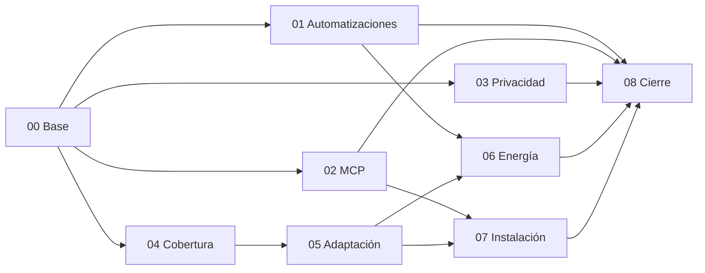

# Auditoría de universalidad de DomoAI por fases

Fecha de referencia: 2026-09-06. Estado: implementación de software y laboratorio registrada en el
[cierre por fases](cierre-implementacion-2026-09-06.md). La auditoría histórica original se conserva.

## Propósito y fuente

Este directorio descompone y desarrolla la [auditoría integral](../auditoria-integral-universalidad-2026-09-06.md). Conserva sus trece hallazgos U-01 a U-13 y añade escenarios, dependencias, preguntas de diseño y criterios de cierre. Las ampliaciones son requisitos de verificación propuestos, no nuevos defectos reproducidos.

La fuente técnica corresponde a `d6c19e0b80631ce6095b7f6bc45a0036003cee78` **más el worktree modificado** que se auditó. Los resultados históricos de 1.941 pruebas aprobadas y 18 omitidas se conservan como evidencia de aquella ejecución. El estado de la implementación realizada se registra en el [cierre por fases](cierre-implementacion-2026-09-06.md) y no convierte la qualification de laboratorio en evidencia física.

El producto sigue siendo un runtime local-first con un único MCP general, un contrato semántico y conectores internos. Universalidad significa una interfaz extensible con cobertura y límites verificables; no que cualquier equipo desconocido pueda controlarse sin configuración.

## Documentos y orden

| Fase | Documento | Resultado que debe conseguirse al ejecutarla |
|---|---|---|
| 00 | [Base, arquitectura y evidencia](fase-00-base-arquitectura-evidencia.md) | Baseline reproducible, componentes y hallazgos trazables. |
| 01 | [Automatizaciones, autoridad y ejecución](fase-01-automatizaciones-autoridad-ejecucion.md) | Autoridad correcta, identidad por ocurrencia y resultados veraces. |
| 02 | [Conformidad e interoperabilidad MCP](fase-02-conformidad-interoperabilidad-mcp.md) | Transporte, errores, esquemas y autenticación comprobados desde un cliente. |
| 03 | [Privacidad y ciclo de vida del dato](fase-03-privacidad-ciclo-datos.md) | Export completo y borrado/retención coherentes con el runtime. |
| 04 | [Cobertura semántica y conectores](fase-04-cobertura-semantica-conectores.md) | Matriz real por operación, protocolo, garantías y evidencia. |
| 05 | [Adaptación, identidad y commissioning](fase-05-adaptacion-identidad-commissioning.md) | Incorporación y cambios de vivienda sin inferir autoridad física. |
| 06 | [Energía y optimización explicable](fase-06-energia-optimizacion-explicable.md) | Propuestas válidas y ejecución coherente con datos y perfiles vigentes. |
| 07 | [Skills, empaquetado e instalación](fase-07-skills-empaquetado-instalacion.md) | Artefactos utilizables fuera del checkout y experiencia verificable por host. |
| 08 | [Resiliencia, calidad y qualification](fase-08-resiliencia-calidad-qualification.md) | Cierre cruzado de software, laboratorio y perfiles físicos explícitos. |

## Dependencias de aceptación

La fase 00 establece la base común. La fase 01 tiene prioridad por fallos funcionales reproducidos. Las fases 02 y 03 pueden prepararse después de 00, coordinando cambios de contratos con 01. La fase 04 define cobertura antes de que 05 pretenda instalarla automáticamente. La fase 06 depende de autoridad, cobertura y commissioning. La fase 07 depende de un contrato MCP estable y de perfiles instalables. La fase 08 comienza a recopilar evidencia desde el inicio, pero su aceptación final depende de las demás.

Esto expresa dependencias del resultado, no una autorización para abrir cambios simultáneos ni una obligación de añadir subsistemas.

## Trazabilidad de hallazgos

Cada hallazgo tiene una fase propietaria. Las demás fases referencian sus efectos sin crear versiones contradictorias del mismo cierre.

| Hallazgo | Severidad original | Evidencia original | Fase propietaria | Consumidores |
|---|---|---|---|---|
| U-01 Autoridad perdida | P1 | Reproducción con servicios reales y fixture | 01 | 03, 05, 06, 08 |
| U-02 Clave reutilizada entre activaciones | P1 | Rechazo real del fixture en segundo evento | 01 | 06, 08 |
| U-03 Resumen de éxito incorrecto | P1 | Rechazo/fallo proyectado como executed | 01 | 02, 06, 07, 08 |
| U-04 Export superior a 4.096 filas | P2 | Error de validación reproducido | 03 | 02, 07, 08 |
| U-05 Origin omitido en GET | P2 | Middleware devuelve 405 | 02 | 07, 08 |
| U-06 Perfil de autenticación acotado | P2 | Inspección; interoperabilidad no completa | 02 | 07, 08 |
| U-07 Cobertura funcional limitada | P1 para universalidad | Dispatch de mappers | 04 | 05, 06, 07, 08 |
| U-08 Riesgo según instalación | P2 | Límite de diseño | 05 | 01, 04, 06, 08 |
| U-09 Gates y omisiones | P2 | Inspección y resultados de suite | 08 | Todas |
| U-10 Alcance de privacidad/retención | P2 | Inspección; pruebas activas pendientes | 03 | 08 |
| U-11 Concentración y trazabilidad | P3 | Inspección | 00 | 08 |
| U-12 Skills ausentes del wheel | P2 | Archivo wheel y carga por zipimport | 07 | 08 |
| U-13 Errores y autodescripción MCP | P2 | ClientSession y tools/list | 02 | 07, 08 |

P1 funcional no significa exploit físico demostrado. U-07 es P1 respecto de la promesa universal, no una emergencia de ejecución. No hay certificación de hardware derivada de esta tabla.

## Cómo usar cada documento

1. Leer objetivo, baseline y límites de evidencia.
2. Comprobar de nuevo los archivos citados: pueden haber cambiado desde la auditoría.
3. Reproducir el hallazgo antes de diseñar su corrección.
4. Convertir el alcance elegido en Spec Kit si afecta contratos, estado o varios subsistemas.
5. Implementar sólo bajo una petición de implementación; estas listas son propuestas de cierre.
6. Registrar pruebas nuevas, resultados, skips y revisión de composición.
7. Cerrar la fase sólo cuando se cumplen sus criterios, no cuando se han editado sus archivos.

Las rutas de fuentes y tests son puntos de inspección existentes, no una orden de modificar todos esos archivos. Las matrices describen pruebas que faltan o deben reforzarse, salvo cuando se identifican expresamente como evidencia anterior.

## Formato común de evidencia de cierre

Cada entrega futura deberá registrar: fase y tareas completadas; SHA y cambios locales relevantes; entorno y versiones; comando exacto; tests ejecutados, aprobados, fallidos y omitidos; artefacto local o CI; resultado observado; límites; revisión cruzada y riesgos residuales.

Estados de trabajo propuestos: `pendiente`, `en_revision`, `defecto_reproducido`, `corregido_sin_validar`, `validado_software`, `validado_laboratorio`, `bloqueado_dependencia_externa`, `cualificado_perfil`. Son etiquetas documentales, no nuevos enums del runtime. Un hallazgo cerrado conserva su reproducción y evidencia histórica.

## Límites y relación con otras auditorías

Los documentos `docs/auditoria-fase-0-...` a `docs/auditoria-fase-4-...` ya existían. Esta serie usa un directorio propio y numeración 00–08 para no confundir sus cierres con los nuevos U-01–U-13. La auditoría integral se conserva íntegra como fuente histórica.

No se definen fechas de entrega, esfuerzo exacto o soporte universal certificado: no hay evidencia para estimarlos. Las decisiones sobre OAuth, distribución de Skills, nuevas capabilities y semántica de borrado deben concretarse antes de implementar cada contrato.
